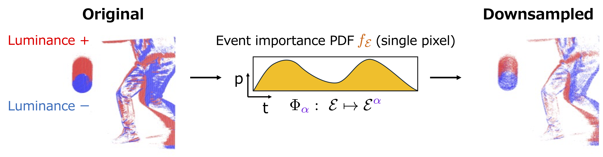
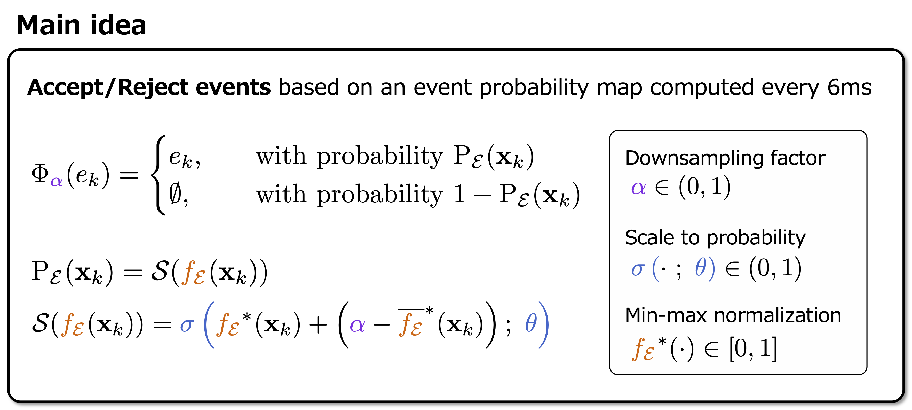
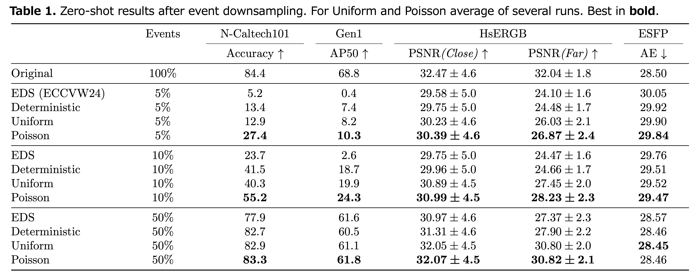
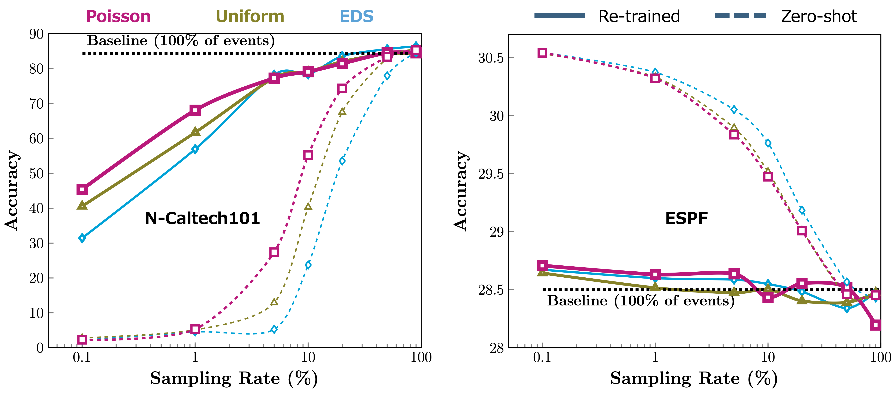

# POLED - Probabilistic Online Event Downsampling
Code for Probabilistic Online Event Downsampling, presented at CVPR Event Vision Wokshop 2025. 

<p align="center">
⭐ Best Paper Finalist Award ⭐
</p>

<p align="center">
  👉 <a href="https://openaccess.thecvf.com/content/CVPR2025W/EventVision/papers/Girbau-Xalabarder_Probabilistic_Online_Event_Downsampling_CVPRW_2025_paper.pdf"><b>Link to paper</b></a> 👈
</p>





## Configuration
### First things first
Clone the repository
```
git clone https://github.com/DensoITLab/POLED
```


### References
Export path variables (they are used in the scripts).

- `$POLED_PATH` --> Your root folder containing the code (usually `.../POLED`).
- `$POLED_DATA` --> Your folder containing all the datasets. As a guide, it will be set to `$POLED_PATH/data`, which contains some samples from NCaltech101.

```
export POLED_PATH=YOURPATH/POLED
export POLED_DATA=$POLED_PATH/data
```

### 1. Docker
If you use docker, congrats! You avoided yourself a lot of trouble. `$POLED_PATH/docker_env/Dockerfile` has some packages that are not needed to replicate the paper (e.g. torch, fiftyone), feel free to delete them, but remember to also erase the imports from the code.

To build the docker image just run:
```
cd $POLED_PATH
bash build_docker.sh
```

To start the docker container:
```
bash docker_env/run_docker.sh
```

### 2. No Docker
You can install all the packages needed with
```
cd $POLED_PATH
pip install -r requirements.txt
```

The bash scripts assume docker (e.g. see `docker exec some_command` in `run_poled.sh`). You can change these instances for `your_python_environment` or similar.

## Quick Example (Downsampling only)
In a new terminal, re-export the variables if needed
```
export POLED_PATH=YOURPATH/POLED
export POLED_DATA=$POLED_PATH/data
```
and run the example
```
cd $POLED_PATH
bash scripts/run_experiments.sh
```

The downsampled data should be generated inside `$POLED_DATA/NCaltech101/sampling` for the downsamplers *uniform* and *poisson* at a downsampling rate of 0.05.


## Custom datasets / methods

For custom testing on several datasets, first (1) generate the `config` files needed to match your folder structure and data paths. You will have to modify `config/master.yaml`, as well as `config/datasets/datasets_paths.yaml`.

Second (2), you will have to modify `external/processor.py` to prepare the dataloader.

Third (3), you will have to modify `src/event_sampling.py` to reference to the new data.

With this you should be able to downsample your data. 

If you want to run the data in a method as well, you will have to make a script (e.g. `scripts/run_NEWMETHOD.sh`). Follow the existing scripts as a guide.

Each of the different methods tested in the paper requires its own Dockerfile. E.g. if you check `docker_id` inside `config/methods/rvt.yaml` you will see that it is point to the **already running** docker container for RVT.

## Results




## Citation
If you find this research useful, please consider citing it.

```
@InProceedings{Girbau-Xalabarder_2025_CVPR,
    author    = {Girbau-Xalabarder, Andreu and Nagata, Jun and Sumiyoshi, Shinichi},
    title     = {Probabilistic Online Event Downsampling},
    booktitle = {Proceedings of the IEEE/CVF Conference on Computer Vision and Pattern Recognition (CVPR) Workshops},
    month     = {June},
    year      = {2025},
    pages     = {4866-4874}
}
```